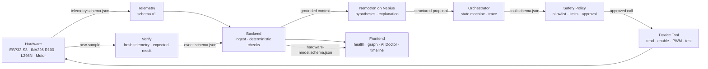
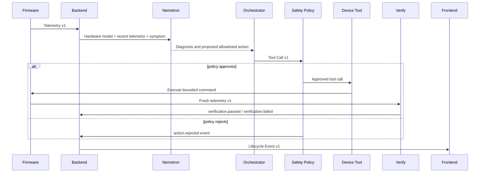

# NeXus MVP architecture

Contract version: `1.0.0` — frozen on 2026-09-08.

## Runtime flow

The model can propose; only the deterministic safety policy can approve. A tool execution is not considered successful until Verify receives a newer telemetry sample and emits `verification.passed`.

## Auto Heal sequence

## Contract boundary

The canonical files live under [`nexus-contracts/v1`](../nexus-contracts/v1/README.md):

| Interface | Canonical identity | Required shared keys |
| --- | --- | --- |
| Hardware model | `urn:nexus:contracts:v1:hardware-model` | `schema_version`, `hardware_model_id`, `device_id`, `components`, `connections`, `safety_limits` |
| Telemetry | `urn:nexus:contracts:v1:telemetry` | `schema_version`, `device_id`, `hardware_model_id`, `sample_id`, `recorded_at`, `sequence`, `measurements`, `quality` |
| Tool call | `urn:nexus:contracts:v1:tool` | `schema_version`, `tool_call_id`, `trace_id`, `device_id`, `tool_name`, `arguments`, `requires_verification` |
| Lifecycle event | `urn:nexus:contracts:v1:event` | `schema_version`, `event_id`, `trace_id`, `device_id`, `event_type`, `source`, `payload` |

The same names are represented in:

- firmware: `firmware/include/nexus_contract_v1.h`
- backend: `backend/src/nexus_backend/contracts.py`
- frontend: `frontend/src/contracts/v1.ts`

## Service boundaries

- Firmware owns measurements, actuator control, command execution, and a local PWM ceiling.
- Backend owns schema validation, the hardware graph, deterministic electrical checks, structured model responses, orchestration, policy, and the audit trail.
- Frontend owns presentation of the fixed topology, health state, telemetry, conversation, and Before/Action/After timeline.
- Nemotron ranks hypotheses and proposes the next test or action. It never defines safety limits and never calls a device directly.
- Safety Policy checks tool allowlist, requested arguments, hardware limits, and approval requirements.
- Verify compares fresh telemetry against the expected observation before an action becomes successful.

## Tool allowlist

- `get_hardware_graph`
- `get_telemetry`
- `read_gpio`
- `enable_driver`
- `set_pwm` from 0 to the model's `max_pwm_percent`
- `run_motor_test` within `max_motor_test_duration_ms`

Every proposal, approval, rejection, execution, and verification result shares one `trace_id`.

## Versioning and migrations

- `schema_version` uses semantic versioning and is mandatory on every envelope.
- Consumers reject unknown major versions and unexpected envelope fields.
- Breaking changes create `nexus-contracts/v2`; they never silently rewrite v1.
- Any intentional v1 schema edit must add a migration note under `nexus-contracts/migrations/` in the same commit. CI checks this rule.
