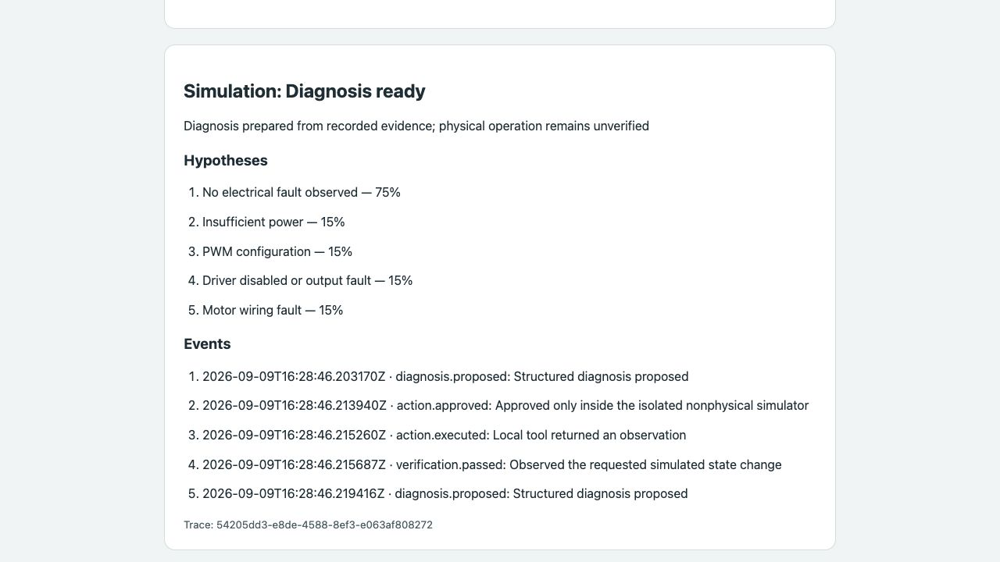
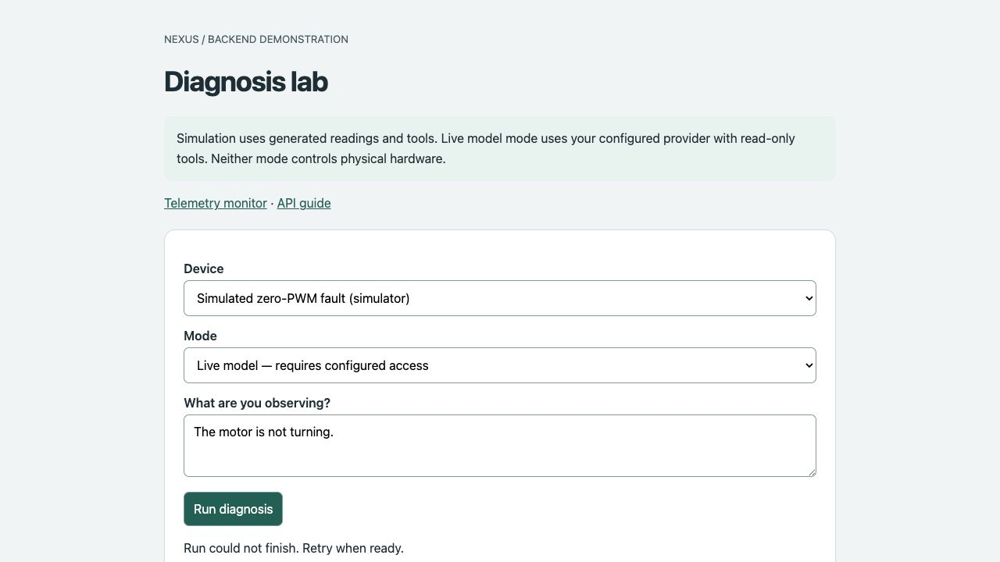

# H01/H04–H08 preemptive software evidence

Checked 10 September 2026. This report covers software prepared before live-model and physical-device integration. These six H tasks remain in progress under the full task acceptance criteria.

## Verified

- **282 backend tests passed.** Provider tests use mocked HTTP transport; no paid/live call occurred.
- Ruff, repository validator, frozen-contract validator and whitespace checks passed.
- All four frozen schemas/fixtures and three stack mirrors remain compatible.
- Deterministic mock evaluation: **top-2 10/10**, evidence/action validation **10/10**.
- The three explicitly simulated scenarios each passed **5/5** runs. Auto-heal requires correlated approval/execution/verification and new before/after sample identities with the expected simulated state/current change.
- Final Docker image built successfully and ran the packaged evaluation outside the checkout. Prompt, dataset, schemas, fixtures and browser pages were available from the installed package.
- Container runs as UID **10001**; health and capability endpoints work with live access disabled by default.
- Browser `/doctor-lab` ran a simulated zero-PWM fault through policy approval, tool execution and verification, then saved the result and trace.
- Restarting the container preserved the session and its verification events. Persisted input telemetry retained PWM=0: the simulated correction never overwrote device observations.
- Browser live mode with missing configuration displayed a controlled, retryable error and made no model call.
- Container logs emitted the configured JSON run summary without request/provider content.
- Independent reviews found and resolved live-mode mapping, default logging configuration, configuration-only observation handling, safe failure rendering and JSON-escaped credential echoes.
- Integrated upstream GOOUUU ESP32-S3/JGB37 hardware changes and reran all 282 tests. Duplicate-ID tests still assert exact error locations, deriving appended indices from the current fixture. The runbook covers preserving older demo registrations after the topology change.

## Browser evidence

The simulator generates all data in these screenshots. No physical motor operation or real Nemotron response is represented.

## Reproduce

Use [H08 runbook](../h08-runbook.md) for clean startup and [H07 evaluation guide](../h07-evaluation.md) for scoring. The generated local report is `artifacts/h07-evaluation.json`; it explicitly records `h07_complete: false` and lists the untested physical/live gates.

## Still required

- H01/H04: configured Nebius access and successful real model evidence.
- H05/H06: actual command adapter plus verified hardware limits and physical verification.
- H07: N05 real fault profiles/ground truth, live integrated evaluation and repeated physical paths.
- H08: preceding H acceptance and final model-outage release rehearsal. Hosting is optional when using the reproducible runbook.

See the [H resource checklist](../h-resource-checklist.md) for the exact handoff inputs.
