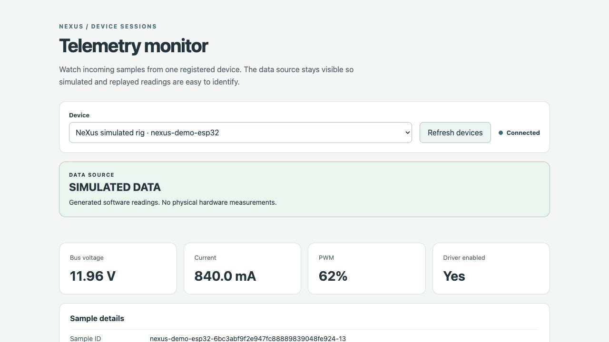

# H02 and H03 acceptance evidence

Verified on 2026-09-10. H02 and H03 share the device registration, canonical validation and hardware-context path in this change.

| Task | Acceptance evidence |
| --- | --- |
| H02 — Backend and device sessions | Persistent configuration, telemetry, session and audit records survive database reopen. Device isolation, retries, atomic audit writes, receive ordering, WebSocket snapshot/new samples/reconnect and health are covered by automated tests. The browser monitor received fresh simulator samples over a real WebSocket connection. |
| H03 — Hardware model and context | The frozen MVP model loads; semantic wiring errors and missing metadata are reported. Context is bounded, scoped to the device/model, source-labeled, and advertises only implemented read operations. Parser/context tests cover malformed payloads and sequence resets. |

## Checks

- `python -m pytest backend/tests -q`: **123 passed**.
- `ruff check backend scripts`: **passed**.
- `python scripts/validate_repo.py`: **passed**.
- `python scripts/validate_contracts.py`: **passed**; four schemas, four fixtures and three stack mirrors checked.
- `git diff --check`: **passed**.
- Independent code review: no material blockers for the local MVP.
- Isolated wheel build/install: packaged schemas and fixtures, simulator, monitor, health, registration, telemetry and context all passed outside the checkout.
- Browser check: monitor reported **Connected**, **SIMULATED DATA**, and advancing sample sequence/readings without reloading.

## Browser evidence

This is generated software data, not physical measurements. No model call or physical motor action is claimed. The React API client/dashboard remain G02/G04 work. The API is for local use and binds to loopback; network authentication is later integration work.

Run the demonstration using the [backend API guide](../backend-api.md). Follow the repository's review process before merging.
