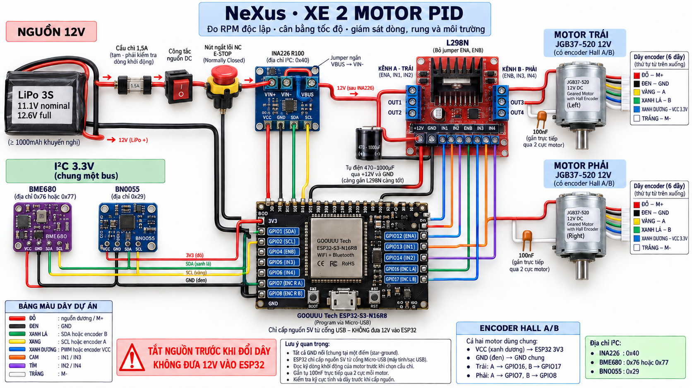

# NeXus dual-motor PID robot — hardware design v1

This is a design draft for the next physical rig. It does not replace the certified
single-motor profile or its firmware until the dual-motor acceptance tests pass.



The machine-readable source is
[`nexus-dual-motor-pid-robot-v1.yaml`](../nexus-hardware/designs/nexus-dual-motor-pid-robot-v1.yaml).
If the physical wire, module address or GPIO changes, update that YAML first and regenerate the
diagram/firmware mapping from the same source.

## What this rig can prove

- Read left and right wheel speed independently from two Hall A/B encoders.
- Detect an RPM mismatch and apply separate PWM on L298N channel A and channel B.
- Tune and test bounded PID without opening the existing unrestricted GPIO surface.
- Correlate total motor-rail voltage/current from INA226 with chassis motion from BNO055 and
  temperature, humidity, pressure and gas resistance from BME680.
- Keep USB logging alive while a DC-rated normally-closed fault switch removes only motor power.

## Exact power path

```text
3S LiPo +
  -> 1.5 A fuse (provisional)
  -> rated master switch
  -> rated NC fault/E-stop switch
  -> INA226 VIN+
  -> INA226 VIN-
  -> L298N +12V/VS

3S LiPo - -> star GND -> L298N, ESP32, INA226, BME680, BNO055, both encoders
```

On the current INA226 module, connect `VBUS/VBS` to `VIN-` with a short jumper. Place the
470–1000 µF electrolytic capacitor directly across L298N `+12V/VS` and `GND`, observing polarity.
Place one 100 nF ceramic capacitor directly across the red/white power terminals of each motor.

The 1.5 A fuse is not final merely because it is in the BOM. Measure combined normal, startup and
stall current first. The final fuse must be above expected operating current while remaining below
the safe current of the battery, switches, L298N module and 20–22 AWG wiring. Do not route motor
current through a small breadboard pushbutton.

Use a protected 3S LiPo or a low-voltage alarm and a 3S balance charger. A 3S pack is approximately
11.1 V nominal and 12.6 V when fully charged. Disconnect the robot load before charging.

## GPIO and L298N map

Remove both ENA and ENB jumpers before connecting PWM.

| Function | GOOUUU ESP32-S3 | Destination | Project wire color |
| --- | --- | --- | --- |
| I²C SDA | GPIO1 | INA226 + BME680 + BNO055 SDA | Green |
| I²C SCL | GPIO2 | INA226 + BME680 + BNO055 SCL | Yellow |
| Left PWM | GPIO12 | L298N ENA | Blue |
| Left direction 1 | GPIO13 | L298N IN1 | Orange |
| Left direction 2 | GPIO14 | L298N IN2 | Purple |
| Right PWM | GPIO4 | L298N ENB | Blue |
| Right direction 1 | GPIO5 | L298N IN3 | Orange |
| Right direction 2 | GPIO6 | L298N IN4 | Purple |
| Left encoder A | GPIO16 | Left motor yellow A wire | Yellow |
| Left encoder B | GPIO17 | Left motor green B wire | Green |
| Right encoder A | GPIO7 | Right motor yellow A wire | Yellow |
| Right encoder B | GPIO8 | Right motor green B wire | Green |

Motor power is `OUT1 -> left red M+`, `OUT2 -> left white M-`, `OUT3 -> right red M+`, and
`OUT4 -> right white M-`. Both encoder blue wires go to ESP32 `3V3`; both encoder black wires go
to star GND. The confirmed six-wire order remains **red, black, yellow, green, blue, white**.

## I²C address gate

Expected default addresses are INA226 `0x40`, BME680 `0x76` (or `0x77` depending on SDO) and
BNO055 `0x29` (alternative `0x28`). Run an I²C scan and chip-identity checks before enabling either
motor. If the scan differs, record the real address in the YAML before changing code.

Power 3.3 V-compatible breakout modules from ESP32 `3V3`. Confirm the actual breakout pin labels
and onboard regulators/level shifters; the raw Bosch sensors and different breakout vendors do not
all have identical supply pins. Multiple breakout pull-ups are parallel, so verify the effective
SDA/SCL pull-up resistance instead of adding resistors blindly.

Mount BNO055 rigidly near the chassis center and document its axis direction. Keep BME680 away from
the L298N heat sink, motor exhaust/airflow and LiPo so its environment reading is not dominated by
the robot's own heat.

## PID acceptance, not guessed gains

The initial loop design uses 20 ms control updates and 100 ms RPM windows. Each wheel has an
independent target and bounded PWM output of 0–80%. Add anti-windup and a PWM slew-rate limit.
Tune `Kp`, `Ki` and `Kd` from recorded step-response data; this design intentionally does not invent
final gains.

Minimum acceptance:

1. Both encoders report valid direction and speed before closed-loop mode is enabled.
2. After settling, left/right RPM mismatch remains within 5% at several target speeds.
3. A temporary load on one wheel causes bounded correction and recovery without sustained
   oscillation.
4. Removing encoder A or B identifies the exact motor/line and stops both motors.
5. Opening the NC E-stop removes 12 V motor power while USB telemetry remains visible.

One INA226 measures the combined driver rail. It is enough for voltage, total-current safety and
RPM PID, but it cannot say which motor consumed extra current. Add a second current channel or one
INA226 per motor branch with different I²C addresses if per-motor electrical diagnosis becomes an
MVP requirement.

## Electrical references

- [ST L298 product page and datasheet](https://www.st.com/en/motor-drivers/l298.html)
- [TI INA226 product page and datasheet](https://www.ti.com/product/INA226)
- [Bosch BNO055 datasheet](https://www.bosch-sensortec.com/media/boschsensortec/downloads/datasheets/bst-bno055-ds000.pdf)
- [Bosch BME680 datasheet](https://www.bosch-sensortec.com/media/boschsensortec/downloads/datasheets/bst-bme680-ds001.pdf)

## Important firmware boundary

The current checked-in firmware controls only one L298N channel and one encoder. Do not connect the
new dual-motor rig and assume PID is active. A separate firmware task must add channel B, the second
encoder, BME680/BNO055 drivers, telemetry fields, hardware-profile identity checks and the PID
safety state machine before physical closed-loop testing.
