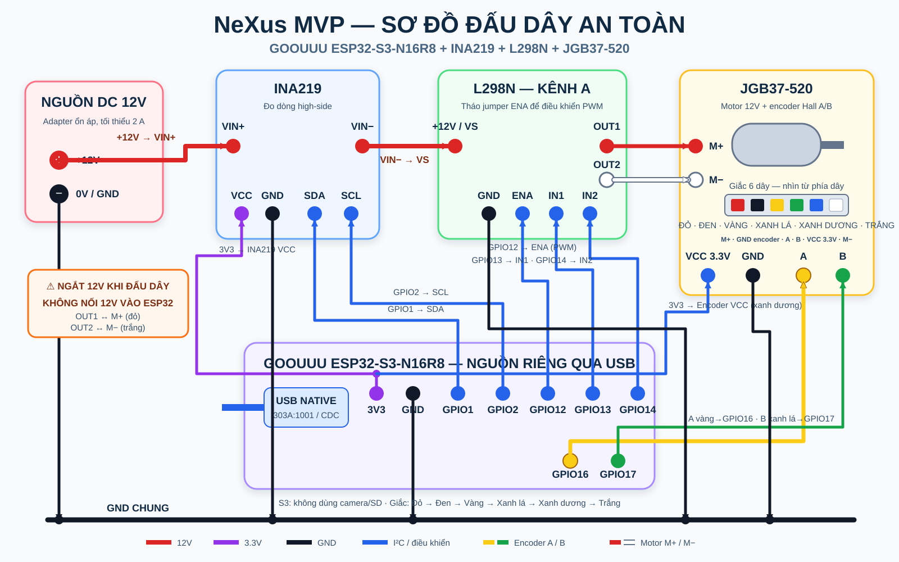

# nexus-firmware

The firmware runs on one GOOUUU Tech ESP32-S3-N16R8. It reads INA219 power telemetry, controls channel A on an L298N motor driver, clamps PWM locally, and emits the frozen telemetry v1 envelope over serial.

## Current MVP state

Available now:

- INA219 voltage/current reads
- L298N channel A enable and direction output
- local `NEXUS_MAX_PWM_PERCENT` clamp
- one JSON telemetry sample per second
- explicit boot/INA219 readiness and failure log lines
- invalid sensor values are withheld instead of emitting non-standard `nan` JSON
- field names shared with backend and frontend contract v1

Command transport is not implemented yet. The device starts with the driver disabled and does not accept serial or MQTT actions in the current foundation.

## Hardware required

- GOOUUU Tech ESP32-S3-N16R8 (16 MB flash, 8 MB PSRAM)
- INA219 voltage/current sensor module
- L298N dual H-bridge motor driver module
- JGB37-520 12 V brushed DC gearmotor with Hall A/B encoder
- regulated 12 V motor supply sized for the motor
- USB data cable
- jumper wires and a physical way to disconnect motor power quickly

Do not power the motor from the ESP32 3.3 V or 5 V pin. Connect all grounds correctly and check the exact terminal labels and jumper positions on your L298N module before applying motor power.

## Signal wiring used by the code

| From | To | Purpose |
| --- | --- | --- |
| ESP32-S3 GPIO1 | INA219 SDA | I²C data |
| ESP32-S3 GPIO2 | INA219 SCL | I²C clock |
| ESP32-S3 GPIO12 | L298N ENA | Channel A PWM speed control; remove the ENA jumper for GPIO PWM |
| ESP32-S3 GPIO13 | L298N IN1 | Direction input; HIGH while running in the current firmware |
| ESP32-S3 GPIO14 | L298N IN2 | Direction input; held LOW in the current firmware |
| L298N OUT1 | Motor M+, red wire | Motor channel A output |
| L298N OUT2 | Motor M−, white wire | Motor channel A output |
| ESP32-S3 GPIO16 | Motor encoder A, yellow wire | Reserved for encoder pulse input |
| ESP32-S3 GPIO17 | Motor encoder B, green wire | Reserved for encoder pulse input |
| ESP32-S3 3V3 | Encoder VCC, blue wire | 3.3 V encoder supply |
| ESP32-S3 GND | INA219 GND, L298N GND and encoder GND, black wire | Common signal reference |

For high-side current measurement, place INA219 in the positive motor-supply path according to the module manufacturer's markings. Do not guess `VIN+` and `VIN-` orientation.

### Wiring diagram



The diagram includes the optional JGB37-520 A/B encoder wiring on GPIO16 and GPIO17. The current firmware configures those pins but does not count pulses yet, so `motor_rpm` remains `null` until encoder support is implemented.

For L298N channel A, ENA receives PWM while IN1/IN2 choose direction. The current MVP firmware implements only IN1 HIGH and IN2 LOW. Stop the motor before changing direction. Do not connect the L298N module's 5 V output to the ESP32 3V3 rail; the ESP32 and encoder use the ESP32's USB/3V3 supply shown in the diagram.

This pin map assumes the GOOUUU camera, microSD slot, and display expansion are not used in the MVP. GPIO12, GPIO13, GPIO16, and GPIO17 overlap camera-interface signals on the camera-capable board. Do not attach a camera while using this wiring. GPIO0, GPIO3, GPIO19, GPIO20, GPIO26–GPIO37, GPIO45, and GPIO46 are intentionally avoided because of boot, USB, flash, or PSRAM restrictions.

The machine-readable topology is [`nexus-contracts/v1/fixtures/hardware-model.example.json`](../nexus-contracts/v1/fixtures/hardware-model.example.json).

## Install PlatformIO

On Windows, double-click `nexus-upload-firmware.cmd` to upload through built-in USB-JTAG. Then close every Serial Monitor and double-click `nexus-start-app.cmd`; the backend owns the COM port and sends the same firmware log to the Hardware Graph UI. Use `nexus-run-firmware.cmd` only for isolated CLI debugging while the app is stopped.

Python 3.11 is recommended.

```bash
python -m pip install platformio
pio --version
```

Alternatively, use the PlatformIO extension in VS Code, but the CLI commands below are the reproducible path used by the team.

## Detect the ESP32 port

Connect the board with a USB data cable, then run:

```bash
pio device list
```

The detected `USB VID:PID=303A:1001` port is the ESP32-S3 native USB port and is supported by the checked-in USB CDC build flag. On the dual-USB GOOUUU board, the connector printed `ESP32` is native USB and the connector printed `CH343` is the USB-to-UART alternative. The CH343 connector is normally the easiest first-upload path because its reset circuit can enter the ROM bootloader automatically. Typical values:

- Windows: `COM4`
- Linux: `/dev/ttyUSB0` or `/dev/ttyACM0`
- macOS: `/dev/cu.usbserial-*`

Use the actual port printed on your machine.

## Build firmware

Run from the repository root:

```bash
pio run --project-dir firmware
```

The default PlatformIO environment is `nexus-goouuu-esp32-s3-n16r8`. It uses the repository's dedicated `boards/nexus-goouuu-esp32-s3-n16r8.json` definition for the GOOUUU Tech board: ESP32-S3, 16 MB QIO flash, 8 MB OPI PSRAM, native USB Serial/JTAG, and the optional onboard CH343 USB-to-UART bridge. It does not select a DevKit board profile.

## Upload and monitor on Windows

For the GOOUUU connector printed `ESP32` (`VID:PID=303A:1001`), upload through the ESP32-S3 built-in USB-JTAG interface. This path does not require a COM-port argument. Stop any open monitor with `Ctrl+C` before uploading:

```powershell
pio run --project-dir firmware --target upload
pio device monitor --port COM8 --baud 115200
```

Press `Ctrl+C` to leave the serial monitor.

## Upload and monitor on macOS or Linux

Replace `/dev/ttyUSB0` with your detected port:

```bash
pio run --project-dir firmware --target upload --upload-port /dev/ttyUSB0
pio device monitor --port /dev/ttyUSB0 --baud 115200
```

On Linux, serial access may require adding your account to the `dialout` group and signing in again. Follow your distribution's policy rather than running PlatformIO permanently as root.

## Build-time configuration

The checked-in defaults are in [`platformio.ini`](platformio.ini):

| Flag | Default | Meaning |
| --- | --- | --- |
| `NEXUS_DEVICE_ID` | `nexus-demo-esp32` | Device identity in every payload |
| `NEXUS_HARDWARE_MODEL_ID` | `nexus-s3-l298n-motor-rig-v1` | Frozen ESP32-S3/L298N hardware model identity |
| `NEXUS_MAX_PWM_PERCENT` | `80` | Absolute firmware PWM ceiling |

Do not raise the PWM ceiling until the physical hardware baseline and temperature checks are complete. Never store Wi-Fi or broker credentials in `platformio.ini`.

## Telemetry output

At 115200 baud, the device emits one compact JSON object per line:

```json
{
  "schema_version": "1.0.0",
  "device_id": "nexus-demo-esp32",
  "hardware_model_id": "nexus-s3-l298n-motor-rig-v1",
  "sample_id": "nexus-demo-esp32-42",
  "recorded_at": null,
  "sequence": 42,
  "measurements": {
    "bus_voltage_v": 11.96,
    "current_ma": 840.0,
    "power_mw": 10046.4,
    "pwm_percent": 0,
    "driver_enabled": false,
    "motor_rpm": null
  },
  "quality": {
    "signal_quality_percent": 100.0,
    "source": "device"
  }
}
```

`recorded_at` remains `null` until a later transport task synchronizes device time. The backend may stamp receipt time but must not rename the field. `motor_rpm` is also `null` until the firmware encoder task reads GPIO16/GPIO17 and converts pulses to RPM.

The firmware also emits readable status lines. `[NEXUS][ERROR][INA219_I2C_NO_ACK]` means the sensor did not acknowledge during startup; `[NEXUS][ERROR][INA219_INVALID_READING]` means a later read was not finite. The firmware retries INA219 every five seconds, while the backend converts these codes into a Vietnamese explanation and repair step in the UI.

## Firmware contract files

- Field-name constants: [`include/nexus_contract_v1.h`](include/nexus_contract_v1.h)
- Canonical telemetry schema: [`../nexus-contracts/v1/schemas/telemetry.schema.json`](../nexus-contracts/v1/schemas/telemetry.schema.json)
- Valid telemetry fixture: [`../nexus-contracts/v1/fixtures/telemetry.example.json`](../nexus-contracts/v1/fixtures/telemetry.example.json)

After changing a telemetry field, run `python scripts/validate_contracts.py` from the repository root. A frozen schema change also requires a migration note.

## Safety before every hardware run

1. Keep motor power off while changing wires.
2. Confirm common ground and INA219 polarity.
3. Confirm L298N supply polarity, ENA jumper state, and that the motor supply is within the motor and driver ratings.
4. Keep the motor mechanically clear and secured.
5. Keep a quick motor-power disconnect within reach.
6. Start with the driver disabled and low PWM.
7. Stop immediately if the driver, wiring, or motor overheats or smells abnormal.

The 30-minute baseline, temperature result, supply rating, and photos belong to backlog item U05/N01 and are not claimed complete by this README.

## Common problems

- No port appears: replace charge-only USB cables; for native USB, look for VID:PID `303A:1001`; for the USB-TTL connector, install the CH343 driver and reconnect.
- `Failed to connect ... No serial data received`: do not add `--upload-port COM8` when using the connector printed `ESP32`; the project uploads over built-in USB-JTAG. If USB-JTAG reports a Windows driver error, move the cable to the connector printed `CH343`, temporarily set `upload_protocol = esptool`, detect its new COM port, and upload to that port after entering bootloader mode if needed.
- Port is busy: close every serial monitor and IDE serial window before upload.
- INA219 is not detected: check SDA/SCL, common ground, module power, and the I²C address.
- Readings are negative: verify INA219 current direction and `VIN+`/`VIN-` orientation.
- Motor never starts: confirm external motor power, ENA jumper/PWM wiring, IN1/IN2, common ground, and the local safety clamp.
- Device resets when the motor starts: isolate motor power noise, inspect supply capacity and wiring, and do not bypass safety limits.
